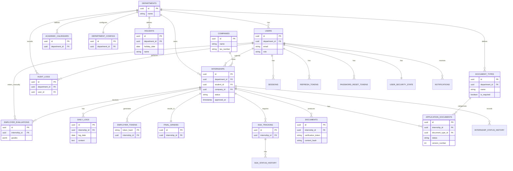

# DATABASE DESIGN DOCUMENT (DDD)

**Project Name:** Internship Management & Automation System (IMAS)

**Database Engine:** PostgreSQL 16+

**Security Level:** High Security / KVKK Compliant

---

## 1. INTRODUCTION

### 1.1 Purpose

This Database Design Document (DDD) defines the logical and physical database design of the Internship Management & Automation System (IMAS). It translates the business requirements defined in the Software Requirements Specification (SRS) and the architectural decisions documented in the Software Architecture Document (SAD) into a secure, scalable, and maintainable PostgreSQL database implementation.

### 1.2 Scope

This document covers the complete database design for IMAS, including:

- Database architecture
- Entity relationship model
- Physical schema design
- PostgreSQL extensions
- Enumerated data types
- Table definitions
- Constraints (CHECK, UNIQUE, FOREIGN KEY)
- Primary and Foreign Keys
- Index strategy
- Row-Level Security (RLS)
- Multi-tenant implementation
- Audit logging with cryptographic chaining
- Security mechanisms
- JSONB usage
- Data integrity
- Performance considerations
- Data retention strategy

### 1.3 Objectives

#### Security

- Enforce department isolation through PostgreSQL Row-Level Security (RLS)
- Prevent unauthorized cross-department data access
- Store passwords using Argon2id hashing
- Protect employer evaluation tokens from disclosure
- Maintain immutable, cryptographically chained audit records
- Use trusted SECURITY DEFINER functions for public/employer access
- Use dedicated database roles for admin access, not application-set role strings

#### Integrity

- Enforce relational consistency through Foreign Keys
- Prevent invalid data using CHECK constraints where appropriate
- Eliminate duplicate records using UNIQUE constraints
- Preserve transactional consistency through ACID guarantees

#### Performance

- Support more than 500 concurrent users
- Optimize tenant-scoped queries using composite indexes
- Minimize index fragmentation
- Maintain efficient join performance

#### Maintainability

- Follow consistent naming conventions
- Normalize relational data
- Separate configuration from transactional data
- Minimize future schema migrations

#### Scalability

- UUIDv7 identifiers
- JSONB configuration storage
- Modular table structure
- Flexible evaluation models
- Configurable grading rules

### 1.4 Assumptions

- PostgreSQL 16+ is the target database engine
- UTF-8 encoding and UTC timezone (TIMESTAMPTZ)
- Deployment via Docker containers
- Backend application built with NestJS / TypeORM
- Database migrations managed by TypeORM migrations
- UUID Version 7 generation will rely on `pg_uuidv7` extension or custom function; placeholder `uuid_generate_v7()` is used
- PDF files and uploaded documents are stored in external object storage (MinIO or S3); only metadata and storage references are stored in PostgreSQL
- All connections between application and database are encrypted using TLS/SSL
- Administrative access uses dedicated DB role `app_admin` (not `app.current_role='ADMIN'`)

---

## 2. DATABASE ARCHITECTURE

### 2.1 Database Model

IMAS uses PostgreSQL 16 as its relational database management system. The database follows a normalized relational design while selectively using JSONB columns for configurable or evolving data structures.

#### Tenant Data

Tenant data belongs to an individual academic department and is protected through PostgreSQL Row-Level Security.

Examples:

- users (except system-wide Admins with NULL department)
- internships
- daily_logs
- academic_calendars
- employer_evaluations
- sgk_tracking
- audit_logs (when department-scoped)
- department_configs
- document_types
- application_documents
- holidays (department-specific)
- internship_status_history
- sgk_status_history

#### Global Data

Global data is shared across the university and is accessible by every department.

Examples:

- companies
- global holidays (department_id IS NULL)
- system_configs
- outbox_events
- notifications (user-scoped, not tenant-scoped)
- sessions
- refresh_tokens
- password_reset_tokens
- user_security_state

### 2.2 Multi-Tenant Architecture

Each university department represents an independent tenant. All departments share a single PostgreSQL database while remaining completely isolated through database-level security policies.

Most tenant-scoped tables contain a `department_id` column. Tables that are children of an internship inherit department ownership through the parent internship rather than storing a duplicate department identifier.

During each authenticated request, the application sets the current department as a PostgreSQL session variable. Row-Level Security policies automatically restrict every query to data belonging only to that department. Tenant context is derived from server-side session, not from client input.

**Admin access:** System-wide administrators connect using a dedicated PostgreSQL role (`app_admin`) that has broad privileges and is not subject to RLS. The application does not set `app.current_role = 'ADMIN'` to bypass RLS. For public/employer access, SECURITY DEFINER functions are used.

### 2.3 Database Characteristics

| Property              | Value                                         |
| --------------------- | --------------------------------------------- |
| Database Engine       | PostgreSQL 16+                                |
| Database Model        | Relational                                    |
| Multi-Tenant          | Yes                                           |
| Row-Level Security    | Enabled and forced on tenant-scoped tables    |
| Primary Keys          | UUIDv7 (column name `id`)                     |
| Character Encoding    | UTF-8                                         |
| Time Zone             | UTC (TIMESTAMPTZ)                             |
| Transactions          | ACID Compliant                                |
| JSON Support          | JSONB                                         |
| Deployment            | Docker Container                              |
| Connection Encryption | TLS/SSL enforced                              |

### 2.4 Physical Architecture

```text
[Application Server]
        │
        ▼ (TLS/SSL)
[Connection Pool (PgBouncer)]
        │
        ▼ (TLS/SSL)
[PostgreSQL 16 Database]
        │
        ├── Tables
        ├── Indexes
        ├── RLS Policies
        └── Functions / Triggers
```

---

## 3. DATABASE DESIGN PRINCIPLES

### 3.1 Naming Conventions

#### Tables

All table names use lowercase letters, plural nouns, and snake_case formatting.

Examples: `users`, `companies`, `daily_logs`, `audit_logs`, `document_types`, `application_documents`, `holidays`, `internship_status_history`

#### Columns

All column names use snake_case.

Examples: `department_id`, `student_number`, `password_hash`, `created_at`, `updated_at`

#### Primary Keys

Every table uses a primary key column named `id` (except `employer_tokens` where `token_hash` is PK and `user_security_state` where `user_id` is PK). Data type is UUIDv7 generated by the database.

#### Foreign Keys

Foreign key columns always reference the primary key of another table, using the pattern `<referenced_table>_id`.

Examples: `department_id`, `student_id`, `company_id`, `internship_id`, `entered_by`, `document_type_id`

#### Constraints

Constraints follow a consistent naming convention.

Examples: `pk_users`, `fk_users_department`, `ck_users_email_format`, `uq_company_tax_number`

#### Indexes

Indexes follow the naming format: `idx_<table>_<column>`

Examples: `idx_users_email_lower`, `idx_internships_department_status`, `idx_daily_logs_log_date`

---

## 4. PRIMARY KEY STRATEGY

### 4.1 UUID Version 7

Every table uses UUID Version 7 as its primary key. UUIDv7 combines globally unique identifiers with chronological ordering, reducing index fragmentation while preventing identifier enumeration.

Example:

```text
018fa64d-fdd2-7a3b-9d52-bce6450d9a2b
```

Advantages:

- Globally unique identifiers
- Resistant to enumeration attacks
- Better B-Tree performance
- Suitable for distributed systems
- Naturally sortable by creation time

### 4.2 UUID Generation

UUIDs are generated directly by PostgreSQL using the `pg_uuidv7` extension (or an equivalent custom function). The function `uuid_generate_v7()` is used as a placeholder throughout this document.

---

## 5. ENTITY RELATIONSHIP DIAGRAM (CONCEPTUAL)

The diagram below is a simplified conceptual ERD showing core relationships. Full column details are in Section 7.



---

## 6. ENTITY OVERVIEW

| Entity                   | Description                                           | Department Ownership            |
| ------------------------ | ----------------------------------------------------- | ------------------------------- |
| departments              | University departments (tenants)                      | N/A (itself)                    |
| users                    | Students, academics, administrators                   | Direct (`department_id` nullable for system Admins) |
| companies                | Shared registry of internship companies               | Global, no department           |
| internships              | Central internship workflow                           | Direct (`department_id`)        |
| daily_logs               | Student internship diary entries                      | Inherited via internship        |
| employer_tokens          | Secure one-time employer evaluation links             | Inherited via internship        |
| employer_evaluations     | Employer assessment records                           | Inherited via internship        |
| final_grades             | Calculated internship grades                          | Inherited via internship        |
| documents                | Generated PDF documents and verification records      | Inherited via internship        |
| academic_calendars       | Department internship periods                         | Direct (`department_id`)        |
| department_configs       | Department-specific grading and configuration         | Direct (`department_id`)        |
| sgk_tracking             | Social security tracking records                      | Inherited via internship        |
| audit_logs               | Immutable audit trail                                 | Direct (`department_id`) nullable for global events |
| document_types           | Configurable document type definitions per dept       | Direct (`department_id`)        |
| application_documents    | Uploaded application documents with versioning        | Inherited via internship        |
| holidays                 | Public and department-specific holidays               | Direct (`department_id`) nullable for global |
| sessions                 | Server-side user sessions                             | User-scoped (not tenant-scoped) |
| refresh_tokens           | Rotating refresh tokens                               | User-scoped (not tenant-scoped) |
| password_reset_tokens    | Password reset tokens                                 | User-scoped (not tenant-scoped) |
| user_security_state      | Failed login attempts, lockout, password change info  | User-scoped (not tenant-scoped) |
| system_configs           | System-wide runtime configuration                     | Global (not tenant-scoped)      |
| notifications            | In-app notifications                                  | User-scoped (not tenant-scoped) |
| outbox_events            | Asynchronous event outbox                             | Global (not tenant-scoped)      |
| internship_status_history| History of internship state transitions               | Inherited via internship        |
| sgk_status_history       | History of SGK status changes                         | Inherited via sgk_tracking      |

---

## 7. SCHEMA DEFINITIONS

### 7.1 PostgreSQL Extensions

```sql
-- UUIDv7 generation (pg_uuidv7 extension or custom function)
-- Ensure uuid_generate_v7() is available.

-- Cryptographic functions
CREATE EXTENSION IF NOT EXISTS pgcrypto;
```

### 7.2 Enumerated Types

```sql
CREATE TYPE user_role AS ENUM (
    'STUDENT',
    'ACADEMIC',
    'ADMIN'
);

CREATE TYPE internship_status AS ENUM (
    'DRAFT',
    'APPLIED',
    'REVISION',
    'APPROVED',
    'REJECTED',
    'ONGOING',
    'EVALUATION',
    'GRADED',
    'COMPLETED',
    'WITHDRAWN'
);

CREATE TYPE sgk_status AS ENUM (
    'PENDING',
    'SUBMITTED',
    'ACTIVE'
);

CREATE TYPE evaluation_method AS ENUM (
    'DIGITAL',
    'MANUAL'
);

CREATE TYPE document_type AS ENUM (
    'STAJ_DEFTERI',
    'SGK_ENTRY',
    'SGK_EXIT'
);

CREATE TYPE application_document_status AS ENUM (
    'PENDING',
    'ACCEPTED',
    'REJECTED'
);
```

### 7.3 Core Tables

#### Departments

```sql
CREATE TABLE departments (
    id UUID PRIMARY KEY DEFAULT uuid_generate_v7(),
    name VARCHAR(255) NOT NULL UNIQUE CHECK (length(trim(name)) > 0),
    faculty_name VARCHAR(255) NOT NULL CHECK (length(trim(faculty_name)) > 0),
    created_at TIMESTAMPTZ NOT NULL DEFAULT NOW(),
    updated_at TIMESTAMPTZ NOT NULL DEFAULT NOW()
);
```

#### Users

```sql
CREATE TABLE users (
    id UUID PRIMARY KEY DEFAULT uuid_generate_v7(),
    department_id UUID,
    email VARCHAR(255) NOT NULL CHECK (length(trim(email)) > 0),
    password_hash TEXT NOT NULL,
    role user_role NOT NULL,
    first_name VARCHAR(100) NOT NULL CHECK (length(trim(first_name)) > 0),
    last_name VARCHAR(100) NOT NULL CHECK (length(trim(last_name)) > 0),
    student_number VARCHAR(20),
    is_active BOOLEAN NOT NULL DEFAULT TRUE,
    last_login TIMESTAMPTZ,
    created_at TIMESTAMPTZ NOT NULL DEFAULT NOW(),
    updated_at TIMESTAMPTZ NOT NULL DEFAULT NOW(),

    CONSTRAINT fk_users_department
        FOREIGN KEY (department_id)
        REFERENCES departments(id)
        ON UPDATE CASCADE
        ON DELETE SET NULL,

    CONSTRAINT ck_users_email_format CHECK (
        email ~* '^[A-Za-z0-9._%+-]+@[A-Za-z0-9.-]+\.[A-Za-z]{2,}$'
    ),

    CONSTRAINT ck_users_student_number CHECK (
        (role = 'STUDENT' AND student_number IS NOT NULL AND department_id IS NOT NULL)
        OR
        (role IN ('ACADEMIC','ADMIN') AND student_number IS NULL)
    ),

    CONSTRAINT uq_users_student_number_dept UNIQUE (department_id, student_number)
);

CREATE UNIQUE INDEX idx_users_email_lower ON users (LOWER(email));
```

> **Note:** System-wide Admins may have `department_id = NULL`. RFC-compliant email validation is performed at the application layer.

#### Companies

```sql
CREATE TABLE companies (
    id UUID PRIMARY KEY DEFAULT uuid_generate_v7(),
    name VARCHAR(255) NOT NULL CHECK (length(trim(name)) > 0),
    tax_number VARCHAR(10) NOT NULL UNIQUE CHECK (tax_number ~ '^[0-9]{10}$'),
    city VARCHAR(100) NOT NULL CHECK (length(trim(city)) > 0),
    industry VARCHAR(100) NOT NULL CHECK (length(trim(industry)) > 0),
    address TEXT,
    website VARCHAR(255),
    contact_person VARCHAR(100),
    contact_email VARCHAR(255),
    contact_phone VARCHAR(30),
    is_verified BOOLEAN NOT NULL DEFAULT FALSE,
    is_active BOOLEAN NOT NULL DEFAULT TRUE,
    created_at TIMESTAMPTZ NOT NULL DEFAULT NOW(),
    updated_at TIMESTAMPTZ NOT NULL DEFAULT NOW(),

    CONSTRAINT ck_companies_contact_email_format CHECK (
        contact_email IS NULL OR
        contact_email ~* '^[A-Za-z0-9._%+-]+@[A-Za-z0-9.-]+\.[A-Za-z]{2,}$'
    ),
    CONSTRAINT ck_companies_contact_phone_format CHECK (
        contact_phone IS NULL OR
        contact_phone ~ '^\+?[0-9\s\-]{7,}$'
    )
);

CREATE UNIQUE INDEX idx_company_email_unique
ON companies (LOWER(contact_email))
WHERE contact_email IS NOT NULL;
```

#### Academic Calendars

```sql
CREATE TABLE academic_calendars (
    id UUID PRIMARY KEY DEFAULT uuid_generate_v7(),
    department_id UUID NOT NULL,
    term_name VARCHAR(100) NOT NULL CHECK (length(trim(term_name)) > 0),
    application_start DATE NOT NULL,
    application_end DATE NOT NULL,
    internship_start DATE NOT NULL,
    internship_end DATE NOT NULL,
    created_at TIMESTAMPTZ NOT NULL DEFAULT NOW(),
    updated_at TIMESTAMPTZ NOT NULL DEFAULT NOW(),

    CONSTRAINT fk_calendar_department
        FOREIGN KEY (department_id)
        REFERENCES departments(id)
        ON UPDATE CASCADE
        ON DELETE CASCADE,

    CONSTRAINT uq_calendar_term UNIQUE (department_id, term_name),
    CONSTRAINT ck_calendars_application_dates CHECK (application_end >= application_start),
    CONSTRAINT ck_calendars_internship_dates CHECK (internship_end >= internship_start),
    CONSTRAINT ck_calendars_app_before_internship CHECK (application_end <= internship_start),
    CONSTRAINT ck_calendar_period CHECK (application_start <= internship_end)
);
```

#### Internships

```sql
CREATE TABLE internships (
    id UUID PRIMARY KEY DEFAULT uuid_generate_v7(),
    department_id UUID NOT NULL,
    student_id UUID NOT NULL,
    company_id UUID NOT NULL,
    status internship_status NOT NULL DEFAULT 'DRAFT',
    start_date DATE NOT NULL,
    end_date DATE NOT NULL,
    grading_data JSONB NOT NULL DEFAULT '{}'::jsonb CHECK (jsonb_typeof(grading_data)='object'),
    locked BOOLEAN NOT NULL DEFAULT FALSE,
    approved_at TIMESTAMPTZ,
    approved_by UUID,
    created_at TIMESTAMPTZ NOT NULL DEFAULT NOW(),
    updated_at TIMESTAMPTZ NOT NULL DEFAULT NOW(),

    CONSTRAINT fk_internship_department
        FOREIGN KEY (department_id)
        REFERENCES departments(id)
        ON UPDATE CASCADE
        ON DELETE RESTRICT,

    CONSTRAINT fk_internship_student
        FOREIGN KEY (student_id)
        REFERENCES users(id)
        ON UPDATE CASCADE
        ON DELETE RESTRICT,

    CONSTRAINT fk_internship_company
        FOREIGN KEY (company_id)
        REFERENCES companies(id)
        ON UPDATE CASCADE
        ON DELETE RESTRICT,

    CONSTRAINT fk_internship_approved_by
        FOREIGN KEY (approved_by)
        REFERENCES users(id)
        ON UPDATE CASCADE
        ON DELETE SET NULL,

    CONSTRAINT ck_internships_dates CHECK (end_date > start_date),
    CONSTRAINT uq_internships_student_company_start UNIQUE (student_id, company_id, start_date),
    CONSTRAINT ck_locked_completed CHECK (locked = FALSE OR status IN ('GRADED','COMPLETED')),
    CONSTRAINT ck_approved_fields CHECK (
        (status IN ('APPROVED','ONGOING','EVALUATION','GRADED','COMPLETED') AND approved_at IS NOT NULL)
        OR
        (status NOT IN ('APPROVED','ONGOING','EVALUATION','GRADED','COMPLETED') AND approved_at IS NULL)
    )
);
```

#### Daily Logs

```sql
CREATE TABLE daily_logs (
    id UUID PRIMARY KEY DEFAULT uuid_generate_v7(),
    internship_id UUID NOT NULL,
    log_date DATE NOT NULL,
    content TEXT NOT NULL CHECK (length(trim(content)) > 0),
    created_at TIMESTAMPTZ NOT NULL DEFAULT NOW(),
    updated_at TIMESTAMPTZ NOT NULL DEFAULT NOW(),

    CONSTRAINT fk_log_internship
        FOREIGN KEY (internship_id)
        REFERENCES internships(id)
        ON UPDATE CASCADE
        ON DELETE CASCADE,

    CONSTRAINT uq_log_date UNIQUE (internship_id, log_date)
);
```

#### Employer Tokens

```sql
CREATE TABLE employer_tokens (
    token_hash CHAR(64) PRIMARY KEY CHECK (token_hash ~ '^[A-Fa-f0-9]{64}$'),
    internship_id UUID NOT NULL,
    expires_at TIMESTAMPTZ NOT NULL,
    is_used BOOLEAN NOT NULL DEFAULT FALSE,
    used_at TIMESTAMPTZ,
    created_at TIMESTAMPTZ NOT NULL DEFAULT NOW(),

    CONSTRAINT fk_token_internship
        FOREIGN KEY (internship_id)
        REFERENCES internships(id)
        ON UPDATE CASCADE
        ON DELETE CASCADE,

    CONSTRAINT ck_tokens_expiry CHECK (expires_at > created_at AND expires_at <= created_at + INTERVAL '7 days'),
    CONSTRAINT ck_tokens_used_at CHECK (
        (is_used = FALSE AND used_at IS NULL)
        OR
        (is_used = TRUE AND used_at IS NOT NULL)
    ),
    CONSTRAINT ck_token_usage_time CHECK (used_at IS NULL OR used_at <= expires_at)
);

CREATE UNIQUE INDEX idx_one_active_token_per_internship
ON employer_tokens (internship_id)
WHERE is_used = FALSE;
```

#### SGK Tracking

```sql
CREATE TABLE sgk_tracking (
    id UUID PRIMARY KEY DEFAULT uuid_generate_v7(),
    internship_id UUID NOT NULL,
    status sgk_status NOT NULL DEFAULT 'PENDING',
    document_path VARCHAR(500),
    created_at TIMESTAMPTZ NOT NULL DEFAULT NOW(),
    updated_at TIMESTAMPTZ NOT NULL DEFAULT NOW(),

    CONSTRAINT fk_sgk_internship
        FOREIGN KEY (internship_id)
        REFERENCES internships(id)
        ON UPDATE CASCADE
        ON DELETE CASCADE
);
```

#### Employer Evaluations

```sql
CREATE TABLE employer_evaluations (
    id UUID PRIMARY KEY DEFAULT uuid_generate_v7(),
    internship_id UUID NOT NULL,
    method evaluation_method NOT NULL,
    employer_name VARCHAR(255) NOT NULL CHECK (length(trim(employer_name)) > 0),
    entered_by UUID,
    grades JSONB NOT NULL CHECK (jsonb_typeof(grades)='object'),
    comments TEXT,
    scanned_sicil_fisi_path VARCHAR(500),
    submitted_at TIMESTAMPTZ NOT NULL DEFAULT NOW(),
    updated_at TIMESTAMPTZ NOT NULL DEFAULT NOW(),

    CONSTRAINT fk_eval_internship
        FOREIGN KEY (internship_id)
        REFERENCES internships(id)
        ON UPDATE CASCADE
        ON DELETE CASCADE,

    CONSTRAINT fk_eval_user
        FOREIGN KEY (entered_by)
        REFERENCES users(id)
        ON UPDATE CASCADE
        ON DELETE SET NULL,

    CONSTRAINT ck_evaluation_method CHECK (
        (method = 'DIGITAL' AND entered_by IS NULL)
        OR
        (method = 'MANUAL' AND entered_by IS NOT NULL)
    )
);
```

#### Final Grades

```sql
CREATE TABLE final_grades (
    id UUID PRIMARY KEY DEFAULT uuid_generate_v7(),
    internship_id UUID NOT NULL UNIQUE,
    employer_score NUMERIC(5,2) NOT NULL,
    academic_score NUMERIC(5,2) NOT NULL,
    final_score NUMERIC(5,2) NOT NULL,
    letter_grade VARCHAR(2) NOT NULL,
    calculated_at TIMESTAMPTZ NOT NULL DEFAULT NOW(),
    updated_at TIMESTAMPTZ NOT NULL DEFAULT NOW(),

    CONSTRAINT fk_final_grade_internship
        FOREIGN KEY (internship_id)
        REFERENCES internships(id)
        ON UPDATE CASCADE
        ON DELETE CASCADE,

    CONSTRAINT ck_final_grades_employer_score CHECK (employer_score BETWEEN 0 AND 100),
    CONSTRAINT ck_final_grades_academic_score CHECK (academic_score BETWEEN 0 AND 100),
    CONSTRAINT ck_final_grades_final_score CHECK (final_score BETWEEN 0 AND 100)
);
```

> **Note:** No hardcoded letter grade CHECK; valid values are determined by the configured `letter_grade_scale` and snapshotted `grading_data`.

#### Documents

```sql
CREATE TABLE documents (
    id UUID PRIMARY KEY DEFAULT uuid_generate_v7(),
    internship_id UUID NOT NULL,
    document_type document_type NOT NULL,
    storage_path VARCHAR(500) NOT NULL CHECK (length(trim(storage_path)) > 0),
    verification_token UUID NOT NULL UNIQUE DEFAULT uuid_generate_v7(),
    content_hash CHAR(64) NOT NULL CHECK (content_hash ~ '^[A-Fa-f0-9]{64}$'),
    signature TEXT,
    signature_algorithm VARCHAR(50),
    signing_key_id VARCHAR(100),
    generated_at TIMESTAMPTZ NOT NULL DEFAULT NOW(),
    updated_at TIMESTAMPTZ NOT NULL DEFAULT NOW(),

    CONSTRAINT fk_document_internship
        FOREIGN KEY (internship_id)
        REFERENCES internships(id)
        ON UPDATE CASCADE
        ON DELETE CASCADE
);
```

#### Department Configurations

```sql
CREATE TABLE department_configs (
    id UUID PRIMARY KEY DEFAULT uuid_generate_v7(),
    department_id UUID NOT NULL UNIQUE,
    grading_weights JSONB NOT NULL DEFAULT '{"employer":40,"academic":60}'::jsonb
        CHECK (jsonb_typeof(grading_weights)='object'),
    letter_grade_scale JSONB NOT NULL DEFAULT '{}'::jsonb
        CHECK (jsonb_typeof(letter_grade_scale)='object'),
    min_internship_duration_working_days INTEGER NOT NULL DEFAULT 30
        CHECK (min_internship_duration_working_days > 0),
    created_at TIMESTAMPTZ NOT NULL DEFAULT NOW(),
    updated_at TIMESTAMPTZ NOT NULL DEFAULT NOW(),

    CONSTRAINT fk_config_department
        FOREIGN KEY (department_id)
        REFERENCES departments(id)
        ON UPDATE CASCADE
        ON DELETE CASCADE
);
```

#### Document Types

```sql
CREATE TABLE document_types (
    id UUID PRIMARY KEY DEFAULT uuid_generate_v7(),
    department_id UUID NOT NULL,
    name VARCHAR(255) NOT NULL CHECK (length(trim(name)) > 0),
    description TEXT,
    is_required BOOLEAN NOT NULL DEFAULT FALSE,
    allowed_file_types TEXT[] NOT NULL DEFAULT ARRAY['pdf','jpg','png'],
    max_file_size INTEGER NOT NULL DEFAULT 5,
    template_path VARCHAR(500),
    created_at TIMESTAMPTZ NOT NULL DEFAULT NOW(),
    updated_at TIMESTAMPTZ NOT NULL DEFAULT NOW(),

    CONSTRAINT fk_document_type_department
        FOREIGN KEY (department_id)
        REFERENCES departments(id)
        ON UPDATE CASCADE
        ON DELETE CASCADE,

    CONSTRAINT uq_document_type_name_dept UNIQUE (department_id, name),
    CONSTRAINT ck_document_types_allowed_types CHECK (allowed_file_types <> '{}')
);
```

#### Application Documents

```sql
CREATE TABLE application_documents (
    id UUID PRIMARY KEY DEFAULT uuid_generate_v7(),
    internship_id UUID NOT NULL,
    document_type_id UUID NOT NULL,
    file_path VARCHAR(500) NOT NULL CHECK (length(trim(file_path)) > 0),
    original_filename VARCHAR(255) NOT NULL CHECK (length(trim(original_filename)) > 0),
    status application_document_status NOT NULL DEFAULT 'PENDING',
    rejection_reason TEXT,
    version_number INTEGER NOT NULL DEFAULT 1 CHECK (version_number > 0),
    uploaded_at TIMESTAMPTZ NOT NULL DEFAULT NOW(),
    updated_at TIMESTAMPTZ NOT NULL DEFAULT NOW(),

    CONSTRAINT fk_application_doc_internship
        FOREIGN KEY (internship_id)
        REFERENCES internships(id)
        ON UPDATE CASCADE
        ON DELETE CASCADE,

    CONSTRAINT fk_application_doc_type
        FOREIGN KEY (document_type_id)
        REFERENCES document_types(id)
        ON UPDATE CASCADE
        ON DELETE RESTRICT,

    CONSTRAINT ck_application_doc_rejection CHECK (
        (status = 'REJECTED' AND rejection_reason IS NOT NULL)
        OR
        (status <> 'REJECTED' AND rejection_reason IS NULL)
    ),

    CONSTRAINT uq_application_doc_version UNIQUE (internship_id, document_type_id, version_number)
);
```

#### Holidays

```sql
CREATE TABLE holidays (
    id UUID PRIMARY KEY DEFAULT uuid_generate_v7(),
    department_id UUID,
    holiday_date DATE NOT NULL,
    name VARCHAR(255) NOT NULL CHECK (length(trim(name)) > 0),
    created_at TIMESTAMPTZ NOT NULL DEFAULT NOW(),
    updated_at TIMESTAMPTZ NOT NULL DEFAULT NOW(),

    CONSTRAINT fk_holiday_department
        FOREIGN KEY (department_id)
        REFERENCES departments(id)
        ON UPDATE CASCADE
        ON DELETE CASCADE,

    CONSTRAINT uq_holiday_date_dept UNIQUE (department_id, holiday_date),
    CONSTRAINT ck_holiday_date CHECK (holiday_date >= '2000-01-01')
);

CREATE UNIQUE INDEX idx_global_holiday_unique
ON holidays (holiday_date)
WHERE department_id IS NULL;
```

#### Audit Logs

```sql
CREATE TABLE audit_logs (
    id UUID PRIMARY KEY DEFAULT uuid_generate_v7(),
    department_id UUID,
    user_id UUID,
    action VARCHAR(50) NOT NULL CHECK (length(trim(action)) > 0),
    entity_type VARCHAR(50) NOT NULL CHECK (length(trim(entity_type)) > 0),
    entity_id UUID,
    payload JSONB NOT NULL DEFAULT '{}'::jsonb CHECK (jsonb_typeof(payload)='object'),
    ip_address INET,
    user_agent TEXT,
    previous_hash CHAR(64) NOT NULL CHECK (previous_hash ~ '^[A-Fa-f0-9]{64}$'),
    current_hash CHAR(64) NOT NULL CHECK (current_hash ~ '^[A-Fa-f0-9]{64}$'),
    created_at TIMESTAMPTZ NOT NULL DEFAULT NOW(),

    CONSTRAINT fk_audit_department
        FOREIGN KEY (department_id)
        REFERENCES departments(id)
        ON UPDATE CASCADE
        ON DELETE RESTRICT,

    CONSTRAINT fk_audit_user
        FOREIGN KEY (user_id)
        REFERENCES users(id)
        ON UPDATE CASCADE
        ON DELETE SET NULL
);
```

> **Note:** `entity_id` nullable for global events; `department_id` nullable for system-wide events.

#### Sessions

```sql
CREATE TABLE sessions (
    id UUID PRIMARY KEY DEFAULT uuid_generate_v7(),
    user_id UUID NOT NULL,
    csrf_token VARCHAR(255) NOT NULL,
    expires_at TIMESTAMPTZ NOT NULL,
    last_activity_at TIMESTAMPTZ NOT NULL DEFAULT NOW(),
    revoked_at TIMESTAMPTZ,
    created_at TIMESTAMPTZ NOT NULL DEFAULT NOW(),

    CONSTRAINT fk_session_user
        FOREIGN KEY (user_id)
        REFERENCES users(id)
        ON DELETE CASCADE,

    CONSTRAINT ck_session_expiry CHECK (expires_at > created_at)
);

CREATE INDEX idx_sessions_user ON sessions(user_id);
CREATE INDEX idx_sessions_expires ON sessions(expires_at);
```

#### Refresh Tokens

```sql
CREATE TABLE refresh_tokens (
    id UUID PRIMARY KEY DEFAULT uuid_generate_v7(),
    user_id UUID NOT NULL,
    token_hash CHAR(64) NOT NULL UNIQUE CHECK (token_hash ~ '^[A-Fa-f0-9]{64}$'),
    expires_at TIMESTAMPTZ NOT NULL,
    rotated_at TIMESTAMPTZ,
    revoked_at TIMESTAMPTZ,
    created_at TIMESTAMPTZ NOT NULL DEFAULT NOW(),

    CONSTRAINT fk_refresh_user
        FOREIGN KEY (user_id)
        REFERENCES users(id)
        ON DELETE CASCADE,

    CONSTRAINT ck_refresh_expiry CHECK (expires_at > created_at)
);

CREATE INDEX idx_refresh_user ON refresh_tokens(user_id);
```

#### Password Reset Tokens

```sql
CREATE TABLE password_reset_tokens (
    id UUID PRIMARY KEY DEFAULT uuid_generate_v7(),
    user_id UUID NOT NULL,
    token_hash CHAR(64) NOT NULL UNIQUE CHECK (token_hash ~ '^[A-Fa-f0-9]{64}$'),
    expires_at TIMESTAMPTZ NOT NULL,
    used_at TIMESTAMPTZ,
    created_at TIMESTAMPTZ NOT NULL DEFAULT NOW(),

    CONSTRAINT fk_reset_user
        FOREIGN KEY (user_id)
        REFERENCES users(id)
        ON DELETE CASCADE,

    CONSTRAINT ck_reset_expiry CHECK (expires_at > created_at)
);

CREATE INDEX idx_reset_user ON password_reset_tokens(user_id);
```

#### User Security State

```sql
CREATE TABLE user_security_state (
    user_id UUID PRIMARY KEY REFERENCES users(id) ON DELETE CASCADE,
    failed_login_attempts INTEGER NOT NULL DEFAULT 0 CHECK (failed_login_attempts >= 0),
    locked_until TIMESTAMPTZ,
    password_changed_at TIMESTAMPTZ NOT NULL DEFAULT NOW(),
    updated_at TIMESTAMPTZ NOT NULL DEFAULT NOW()
);
```

#### System Configurations

```sql
CREATE TABLE system_configs (
    key VARCHAR(100) PRIMARY KEY,
    value JSONB NOT NULL,
    description TEXT,
    updated_at TIMESTAMPTZ NOT NULL DEFAULT NOW(),
    updated_by UUID REFERENCES users(id) ON DELETE SET NULL
);
```

#### Notifications

```sql
CREATE TABLE notifications (
    id UUID PRIMARY KEY DEFAULT uuid_generate_v7(),
    user_id UUID NOT NULL REFERENCES users(id) ON DELETE CASCADE,
    type VARCHAR(50) NOT NULL,
    title VARCHAR(255) NOT NULL,
    body TEXT,
    data JSONB NOT NULL DEFAULT '{}'::jsonb CHECK (jsonb_typeof(data)='object'),
    read_at TIMESTAMPTZ,
    created_at TIMESTAMPTZ NOT NULL DEFAULT NOW()
);

CREATE INDEX idx_notifications_user_read ON notifications(user_id, read_at);
```

#### Outbox Events

```sql
CREATE TABLE outbox_events (
    id UUID PRIMARY KEY DEFAULT uuid_generate_v7(),
    event_type VARCHAR(100) NOT NULL,
    payload JSONB NOT NULL,
    created_at TIMESTAMPTZ NOT NULL DEFAULT NOW(),
    processed_at TIMESTAMPTZ,
    error TEXT,
    attempts INTEGER NOT NULL DEFAULT 0 CHECK (attempts >= 0)
);

CREATE INDEX idx_outbox_pending ON outbox_events(created_at) WHERE processed_at IS NULL;
```

> **Note:** `processed_at` serves as `sent_at`; `error` stores delivery failure details.

#### Internship Status History

```sql
CREATE TABLE internship_status_history (
    id UUID PRIMARY KEY DEFAULT uuid_generate_v7(),
    internship_id UUID NOT NULL REFERENCES internships(id) ON DELETE CASCADE,
    from_status internship_status NOT NULL,
    to_status internship_status NOT NULL,
    reason TEXT,
    changed_by UUID REFERENCES users(id) ON DELETE SET NULL,
    changed_at TIMESTAMPTZ NOT NULL DEFAULT NOW()
);

CREATE INDEX idx_status_history_internship ON internship_status_history(internship_id);
```

#### SGK Status History

```sql
CREATE TABLE sgk_status_history (
    id UUID PRIMARY KEY DEFAULT uuid_generate_v7(),
    sgk_tracking_id UUID NOT NULL REFERENCES sgk_tracking(id) ON DELETE CASCADE,
    from_status sgk_status NOT NULL,
    to_status sgk_status NOT NULL,
    changed_by UUID REFERENCES users(id) ON DELETE SET NULL,
    changed_at TIMESTAMPTZ NOT NULL DEFAULT NOW()
);

CREATE INDEX idx_sgk_history_tracking ON sgk_status_history(sgk_tracking_id);
```

---

## 7.4 Automatic Timestamp Update Triggers

```sql
CREATE OR REPLACE FUNCTION fn_update_modified_timestamp()
RETURNS trigger AS
$$
BEGIN
    NEW.updated_at = NOW();
    RETURN NEW;
END;
$$
LANGUAGE plpgsql;

-- Apply to all tables with updated_at
CREATE TRIGGER trg_users_updated_at
    BEFORE UPDATE ON users FOR EACH ROW EXECUTE FUNCTION fn_update_modified_timestamp();
CREATE TRIGGER trg_internships_updated_at
    BEFORE UPDATE ON internships FOR EACH ROW EXECUTE FUNCTION fn_update_modified_timestamp();
CREATE TRIGGER trg_daily_logs_updated_at
    BEFORE UPDATE ON daily_logs FOR EACH ROW EXECUTE FUNCTION fn_update_modified_timestamp();
CREATE TRIGGER trg_companies_updated_at
    BEFORE UPDATE ON companies FOR EACH ROW EXECUTE FUNCTION fn_update_modified_timestamp();
CREATE TRIGGER trg_department_configs_updated_at
    BEFORE UPDATE ON department_configs FOR EACH ROW EXECUTE FUNCTION fn_update_modified_timestamp();
CREATE TRIGGER trg_academic_calendars_updated_at
    BEFORE UPDATE ON academic_calendars FOR EACH ROW EXECUTE FUNCTION fn_update_modified_timestamp();
CREATE TRIGGER trg_sgk_tracking_updated_at
    BEFORE UPDATE ON sgk_tracking FOR EACH ROW EXECUTE FUNCTION fn_update_modified_timestamp();
CREATE TRIGGER trg_employer_evaluations_updated_at
    BEFORE UPDATE ON employer_evaluations FOR EACH ROW EXECUTE FUNCTION fn_update_modified_timestamp();
CREATE TRIGGER trg_documents_updated_at
    BEFORE UPDATE ON documents FOR EACH ROW EXECUTE FUNCTION fn_update_modified_timestamp();
CREATE TRIGGER trg_final_grades_updated_at
    BEFORE UPDATE ON final_grades FOR EACH ROW EXECUTE FUNCTION fn_update_modified_timestamp();
CREATE TRIGGER trg_departments_updated_at
    BEFORE UPDATE ON departments FOR EACH ROW EXECUTE FUNCTION fn_update_modified_timestamp();
CREATE TRIGGER trg_document_types_updated_at
    BEFORE UPDATE ON document_types FOR EACH ROW EXECUTE FUNCTION fn_update_modified_timestamp();
CREATE TRIGGER trg_application_documents_updated_at
    BEFORE UPDATE ON application_documents FOR EACH ROW EXECUTE FUNCTION fn_update_modified_timestamp();
CREATE TRIGGER trg_holidays_updated_at
    BEFORE UPDATE ON holidays FOR EACH ROW EXECUTE FUNCTION fn_update_modified_timestamp();
CREATE TRIGGER trg_user_security_state_updated_at
    BEFORE UPDATE ON user_security_state FOR EACH ROW EXECUTE FUNCTION fn_update_modified_timestamp();
CREATE TRIGGER trg_system_configs_updated_at
    BEFORE UPDATE ON system_configs FOR EACH ROW EXECUTE FUNCTION fn_update_modified_timestamp();
```

---

## 7.5 JSONB Structure Documentation & Validation

### `internships.grading_data`

Snapshot of evaluation parameters at the time the internship enters EVALUATION.

```json
{
  "employer_criteria": [
    "attendance",
    "effort",
    "timeliness",
    "conduct",
    "teamwork",
    "ethics",
    "self_improvement"
  ],
  "academic_criteria": {
    "log_quality": 70,
    "report": 30
  },
  "weights": {
    "employer": 0.4,
    "academic": 0.6
  }
}
```

### `employer_evaluations.grades`

Stores the employer’s assessment on the 7 official criteria.

```json
{
  "attendance": { "letter": "A", "score": 5 },
  "effort": { "letter": "B", "score": 4 },
  "timeliness": { "letter": "A", "score": 5 },
  "conduct": { "letter": "B", "score": 4 },
  "teamwork": { "letter": "C", "score": 3 },
  "ethics": { "letter": "A", "score": 5 },
  "self_improvement": { "letter": "B", "score": 4 }
}
```

### `department_configs.grading_weights`

```json
{
  "employer": 40,
  "academic": 60
}
```

### `department_configs.letter_grade_scale`

```json
{
  "AA": [90, 100],
  "BA": [80, 89],
  "BB": [70, 79],
  "CB": [60, 69],
  "CC": [50, 59],
  "DC": [40, 49],
  "DD": [30, 39],
  "FF": [0, 29]
}
```

---

## 7.6 Foreign Key Delete/Action Rationale

- `ON DELETE CASCADE` for child records whose existence is meaningless without the parent.
- `ON DELETE RESTRICT` for master data.
- `ON UPDATE CASCADE` applied universally.

---

## 7.7 Soft Delete & Data Lifecycle

Operational entities are never physically deleted during normal usage. Users and companies have `is_active` flags. Drafts are marked `WITHDRAWN`. Audit logs are permanently immutable.

---

## 8. ROW-LEVEL SECURITY (RLS)

### 8.1 Session Context

After authentication, the backend sets:

```sql
SELECT set_config('app.current_tenant', '<department_uuid>', true);
```

The application **does not** set `app.current_role`. Admin access uses dedicated `app_admin` DB role.

### 8.2 Enabling and Forcing Row-Level Security

```sql
ALTER TABLE users ENABLE ROW LEVEL SECURITY;
ALTER TABLE users FORCE ROW LEVEL SECURITY;
ALTER TABLE internships ENABLE ROW LEVEL SECURITY;
ALTER TABLE internships FORCE ROW LEVEL SECURITY;
ALTER TABLE daily_logs ENABLE ROW LEVEL SECURITY;
ALTER TABLE daily_logs FORCE ROW LEVEL SECURITY;
ALTER TABLE sgk_tracking ENABLE ROW LEVEL SECURITY;
ALTER TABLE sgk_tracking FORCE ROW LEVEL SECURITY;
ALTER TABLE employer_evaluations ENABLE ROW LEVEL SECURITY;
ALTER TABLE employer_evaluations FORCE ROW LEVEL SECURITY;
ALTER TABLE documents ENABLE ROW LEVEL SECURITY;
ALTER TABLE documents FORCE ROW LEVEL SECURITY;
ALTER TABLE academic_calendars ENABLE ROW LEVEL SECURITY;
ALTER TABLE academic_calendars FORCE ROW LEVEL SECURITY;
ALTER TABLE department_configs ENABLE ROW LEVEL SECURITY;
ALTER TABLE department_configs FORCE ROW LEVEL SECURITY;
ALTER TABLE employer_tokens ENABLE ROW LEVEL SECURITY;
ALTER TABLE employer_tokens FORCE ROW LEVEL SECURITY;
ALTER TABLE audit_logs ENABLE ROW LEVEL SECURITY;
ALTER TABLE audit_logs FORCE ROW LEVEL SECURITY;
ALTER TABLE document_types ENABLE ROW LEVEL SECURITY;
ALTER TABLE document_types FORCE ROW LEVEL SECURITY;
ALTER TABLE application_documents ENABLE ROW LEVEL SECURITY;
ALTER TABLE application_documents FORCE ROW LEVEL SECURITY;
ALTER TABLE holidays ENABLE ROW LEVEL SECURITY;
ALTER TABLE holidays FORCE ROW LEVEL SECURITY;
ALTER TABLE internship_status_history ENABLE ROW LEVEL SECURITY;
ALTER TABLE internship_status_history FORCE ROW LEVEL SECURITY;
ALTER TABLE sgk_status_history ENABLE ROW LEVEL SECURITY;
ALTER TABLE sgk_status_history FORCE ROW LEVEL SECURITY;
```

### 8.3 Tenant Isolation Policies

Policies do **not** include `app.current_role = 'ADMIN'`.

#### Direct `department_id` tables

```sql
CREATE POLICY tenant_policy_users ON users FOR ALL
USING (department_id = current_setting('app.current_tenant', true)::uuid)
WITH CHECK (department_id = current_setting('app.current_tenant', true)::uuid);

CREATE POLICY tenant_policy_internships ON internships FOR ALL
USING (department_id = current_setting('app.current_tenant', true)::uuid)
WITH CHECK (department_id = current_setting('app.current_tenant', true)::uuid);

CREATE POLICY tenant_policy_calendars ON academic_calendars FOR ALL
USING (department_id = current_setting('app.current_tenant', true)::uuid)
WITH CHECK (department_id = current_setting('app.current_tenant', true)::uuid);

CREATE POLICY tenant_policy_configs ON department_configs FOR ALL
USING (department_id = current_setting('app.current_tenant', true)::uuid)
WITH CHECK (department_id = current_setting('app.current_tenant', true)::uuid);

CREATE POLICY tenant_policy_audit_logs ON audit_logs FOR ALL
USING (department_id IS NULL
       OR department_id = current_setting('app.current_tenant', true)::uuid)
WITH CHECK (department_id IS NULL
            OR department_id = current_setting('app.current_tenant', true)::uuid);

CREATE POLICY tenant_policy_document_types ON document_types FOR ALL
USING (department_id = current_setting('app.current_tenant', true)::uuid)
WITH CHECK (department_id = current_setting('app.current_tenant', true)::uuid);

CREATE POLICY tenant_policy_holidays ON holidays FOR ALL
USING (department_id IS NULL
       OR department_id = current_setting('app.current_tenant', true)::uuid)
WITH CHECK (department_id IS NULL
            OR department_id = current_setting('app.current_tenant', true)::uuid);
```

#### Tables inheriting department via `internship_id`

These policies use an EXISTS subquery.

```sql
CREATE POLICY tenant_policy_daily_logs ON daily_logs FOR ALL
USING (EXISTS (SELECT 1 FROM internships i WHERE i.id = internship_id AND i.department_id = current_setting('app.current_tenant', true)::uuid))
WITH CHECK (EXISTS (SELECT 1 FROM internships i WHERE i.id = internship_id AND i.department_id = current_setting('app.current_tenant', true)::uuid));

CREATE POLICY tenant_policy_sgk ON sgk_tracking FOR ALL
USING (EXISTS (SELECT 1 FROM internships i WHERE i.id = internship_id AND i.department_id = current_setting('app.current_tenant', true)::uuid))
WITH CHECK (EXISTS (SELECT 1 FROM internships i WHERE i.id = internship_id AND i.department_id = current_setting('app.current_tenant', true)::uuid));

CREATE POLICY tenant_policy_evaluations ON employer_evaluations FOR ALL
USING (EXISTS (SELECT 1 FROM internships i WHERE i.id = internship_id AND i.department_id = current_setting('app.current_tenant', true)::uuid))
WITH CHECK (EXISTS (SELECT 1 FROM internships i WHERE i.id = internship_id AND i.department_id = current_setting('app.current_tenant', true)::uuid));

CREATE POLICY tenant_policy_documents ON documents FOR ALL
USING (EXISTS (SELECT 1 FROM internships i WHERE i.id = internship_id AND i.department_id = current_setting('app.current_tenant', true)::uuid))
WITH CHECK (EXISTS (SELECT 1 FROM internships i WHERE i.id = internship_id AND i.department_id = current_setting('app.current_tenant', true)::uuid));

CREATE POLICY tenant_policy_tokens ON employer_tokens FOR ALL
USING (EXISTS (SELECT 1 FROM internships i WHERE i.id = internship_id AND i.department_id = current_setting('app.current_tenant', true)::uuid))
WITH CHECK (EXISTS (SELECT 1 FROM internships i WHERE i.id = internship_id AND i.department_id = current_setting('app.current_tenant', true)::uuid));

CREATE POLICY tenant_policy_application_documents ON application_documents FOR ALL
USING (EXISTS (SELECT 1 FROM internships i WHERE i.id = internship_id AND i.department_id = current_setting('app.current_tenant', true)::uuid))
WITH CHECK (EXISTS (SELECT 1 FROM internships i WHERE i.id = internship_id AND i.department_id = current_setting('app.current_tenant', true)::uuid));

CREATE POLICY tenant_policy_internship_history ON internship_status_history FOR ALL
USING (EXISTS (SELECT 1 FROM internships i WHERE i.id = internship_id AND i.department_id = current_setting('app.current_tenant', true)::uuid))
WITH CHECK (EXISTS (SELECT 1 FROM internships i WHERE i.id = internship_id AND i.department_id = current_setting('app.current_tenant', true)::uuid));

CREATE POLICY tenant_policy_sgk_history ON sgk_status_history FOR ALL
USING (EXISTS (SELECT 1 FROM sgk_tracking s JOIN internships i ON i.id = s.internship_id WHERE s.id = sgk_tracking_id AND i.department_id = current_setting('app.current_tenant', true)::uuid))
WITH CHECK (EXISTS (SELECT 1 FROM sgk_tracking s JOIN internships i ON i.id = s.internship_id WHERE s.id = sgk_tracking_id AND i.department_id = current_setting('app.current_tenant', true)::uuid));
```

> **Note:** `companies`, `sessions`, `refresh_tokens`, `password_reset_tokens`, `user_security_state`, `system_configs`, `notifications`, `outbox_events` are not tenant-scoped.

### 8.4 SECURITY DEFINER Functions

#### Public Document Verification

```sql
CREATE OR REPLACE FUNCTION verify_document(p_token UUID)
RETURNS TABLE (
    student_name TEXT,
    internship_status internship_status,
    approval_date TIMESTAMPTZ
)
LANGUAGE sql
SECURITY DEFINER
STABLE
AS
$$
    SELECT u.first_name || ' ' || u.last_name,
           i.status,
           i.approved_at
    FROM documents d
    JOIN internships i ON i.id = d.internship_id
    JOIN users u ON u.id = i.student_id
    WHERE d.verification_token = p_token;
$$;

REVOKE ALL ON FUNCTION verify_document(UUID) FROM PUBLIC;
GRANT EXECUTE ON FUNCTION verify_document(UUID) TO app_user;
```

#### Employer Token Validation

```sql
CREATE OR REPLACE FUNCTION validate_employer_token(p_token_hash CHAR(64))
RETURNS TABLE (
    internship_id UUID,
    expires_at TIMESTAMPTZ,
    is_used BOOLEAN
)
LANGUAGE sql
SECURITY DEFINER
STABLE
AS
$$
    SELECT et.internship_id,
           et.expires_at,
           et.is_used
    FROM employer_tokens et
    WHERE et.token_hash = p_token_hash;
$$;

REVOKE ALL ON FUNCTION validate_employer_token(CHAR(64)) FROM PUBLIC;
GRANT EXECUTE ON FUNCTION validate_employer_token(CHAR(64)) TO app_user;
```

---

## 9. INDEXES

```sql
-- Direct department filtering
CREATE INDEX idx_users_department ON users(department_id);
CREATE INDEX idx_internships_department_status ON internships(department_id, status);
CREATE INDEX idx_calendars_department ON academic_calendars(department_id);
CREATE INDEX idx_configs_department ON department_configs(department_id);
CREATE INDEX idx_audit_department_created ON audit_logs(department_id, created_at);
CREATE INDEX idx_document_types_department ON document_types(department_id);
CREATE INDEX idx_holidays_department ON holidays(department_id);
CREATE INDEX idx_holidays_date ON holidays(holiday_date);

-- Global admin / scheduled job support (no tenant filter)
CREATE INDEX idx_internships_status_start_date ON internships(status, start_date);
CREATE INDEX idx_sgk_tracking_status ON sgk_tracking(status);
CREATE INDEX idx_users_role ON users(role);
CREATE INDEX idx_audit_logs_created_at ON audit_logs(created_at);

-- Relationships
CREATE INDEX idx_internships_student ON internships(student_id);
CREATE INDEX idx_internships_company ON internships(company_id);
CREATE INDEX idx_daily_logs_internship ON daily_logs(internship_id);
CREATE INDEX idx_eval_internship ON employer_evaluations(internship_id);
CREATE INDEX idx_documents_internship ON documents(internship_id);
CREATE INDEX idx_sgk_internship ON sgk_tracking(internship_id);
CREATE INDEX idx_final_grades_internship ON final_grades(internship_id);
CREATE INDEX idx_audit_user ON audit_logs(user_id);
CREATE INDEX idx_application_docs_internship ON application_documents(internship_id);
CREATE INDEX idx_application_docs_type ON application_documents(document_type_id);

-- Business queries
CREATE INDEX idx_daily_logs_date ON daily_logs(log_date);
CREATE INDEX idx_employer_tokens_expiry ON employer_tokens(expires_at);
CREATE INDEX idx_eval_submitted ON employer_evaluations(submitted_at);
```

---

## 10. DATABASE FUNCTIONS & TRIGGERS

### 10.1 Timestamp Update (Section 7.4)

### 10.2 Audit Immutability Trigger

```sql
CREATE OR REPLACE FUNCTION fn_reject_audit_mutation()
RETURNS trigger AS
$$
BEGIN
    RAISE EXCEPTION 'Audit logs are immutable.';
END;
$$
LANGUAGE plpgsql;

CREATE TRIGGER trg_audit_immutable
BEFORE UPDATE OR DELETE ON audit_logs
FOR EACH ROW EXECUTE FUNCTION fn_reject_audit_mutation();
```

### 10.3 Audit Cryptographic Chain Insert Trigger (Global Chain)

```sql
CREATE OR REPLACE FUNCTION fn_audit_chain_insert()
RETURNS trigger AS
$$
DECLARE
    prev_hash CHAR(64);
BEGIN
    -- Serialize audit inserts globally
    PERFORM pg_advisory_xact_lock(hashtext('global_audit_chain'));

    -- Retrieve the most recent audit log's current_hash across all records
    SELECT current_hash INTO prev_hash
    FROM audit_logs
    ORDER BY created_at DESC, id DESC
    LIMIT 1;

    IF NOT FOUND THEN
        prev_hash := '0000000000000000000000000000000000000000000000000000000000000000';
    END IF;

    NEW.previous_hash := prev_hash;
    NEW.current_hash := ENCODE(
        DIGEST(
            prev_hash ||
            COALESCE(NEW.department_id::text, '') ||
            COALESCE(NEW.user_id::text, '') ||
            COALESCE(NEW.entity_id::text, '') ||
            NEW.entity_type ||
            NEW.action ||
            NEW.created_at::text ||
            COALESCE(NEW.payload::text, ''),
            'sha256'
        ),
        'hex'
    );

    RETURN NEW;
END;
$$
LANGUAGE plpgsql;

CREATE TRIGGER trg_audit_chain_insert
BEFORE INSERT ON audit_logs
FOR EACH ROW EXECUTE FUNCTION fn_audit_chain_insert();
```

> **Important:** The application must **not** supply values for `previous_hash` and `current_hash`; the trigger overrides them. The chain is **global**, not per department.

---

## 11. STATISTICS & QUERY PLANNING

PostgreSQL autovacuum maintains planner statistics. Manual `VACUUM ANALYZE` after large imports. Composite indexes cover common tenant-scoped filter combinations. `pg_stat_user_indexes` monitored for unused indexes.

---

## 12. DATABASE SECURITY

### 12.1 Password Storage

- Algorithm: Argon2id
- Salt: random per password
- Hashing performed by application layer
- Database stores only the resulting hash

### 12.2 Employer Token Security

1. Generate 256-bit random token.
2. Email plain token to employer.
3. Store `SHA256(plainToken)` in `token_hash`.
4. Compare incoming token hashes.
5. Mark used after successful submission.

### 12.3 Immutable Audit Logs

The cryptographic chain ensures any modification invalidates all subsequent hashes. The immutability trigger physically prevents UPDATE and DELETE. Insert trigger automatically computes chain hashes globally.

### 12.4 Role-Based Permissions

| Role     | Read Scope                 | Write Scope                | Hard Delete |
| -------- | -------------------------- | -------------------------- | ----------- |
| Student  | Own records                | Own applications & logs    | Never       |
| Academic | Department-wide data       | Grade & approve (own dept) | Never       |
| Admin    | All departments (system)   | System configuration       | Limited     |
| Employer | Single internship (token)  | Evaluation form only       | Never       |
| Public   | Verification endpoint only | None                       | Never       |

### 12.5 PostgreSQL Roles

| Role             | Privileges                                    |
| ---------------- | --------------------------------------------- |
| `postgres`       | Superuser (administration only)               |
| `app_user`       | Connect, INSERT, SELECT, UPDATE on all tables |
| `app_admin`      | Bypass RLS, system-wide access                |
| `migration_user` | DDL privileges (schema migrations)            |
| `readonly_user`  | SELECT only (reporting)                       |

**Migration Script Note:** Run once during initial setup or migrations:

```sql
CREATE ROLE app_admin WITH LOGIN PASSWORD '...' BYPASSRLS;
GRANT ALL PRIVILEGES ON ALL TABLES IN SCHEMA public TO app_admin;
GRANT USAGE, SELECT ON ALL SEQUENCES IN SCHEMA public TO app_admin;
ALTER DEFAULT PRIVILEGES IN SCHEMA public GRANT ALL ON TABLES TO app_admin;
```

---

## 13. DATA RETENTION & BACKUP STRATEGY

- Internship records remain online for 5 years, then archived.
- Audit logs kept permanently.
- Final PDFs remain verifiable indefinitely via verification UUID.
- Development: `pg_dump` or Docker volume snapshots.
- Production: weekly full + continuous WAL archiving, AES-256 encryption, off-site storage.

---

## 14. TRANSACTION STRATEGY

All critical operations execute within a database transaction. Default isolation level: `READ COMMITTED`. Optimistic locking via `updated_at` comparison prevents lost updates. Outbox events are written in the same transaction as business data.

Example Grade Finalization:

```
BEGIN
  ├── INSERT employer_evaluations
  ├── SELECT weights FROM department_configs
  ├── CALCULATE scores
  ├── INSERT final_grades
  ├── UPDATE internships SET status = 'GRADED'
  ├── INSERT audit_logs
  └── INSERT outbox_events
COMMIT
```

---

## 15. DATABASE VIEWS (Optional)

- `vw_student_progress` – joins internships with daily logs and status
- `vw_pending_evaluations` – internships awaiting employer or academic grading
- `vw_department_dashboard` – key metrics per department
- `vw_company_statistics` – internship counts and ratings per company

Views respect RLS policies applied to their base tables.

---

## 16. DATA DICTIONARY

| Table                   | Description                                            |
| ----------------------- | ------------------------------------------------------ |
| departments             | University departments (tenants)                       |
| users                   | Students, academics, administrators                    |
| companies               | Shared partner company registry                        |
| internships             | Lifecycle of each student internship                   |
| daily_logs              | Student daily work descriptions                        |
| employer_tokens         | Secure one-time grading links                          |
| employer_evaluations    | Employer assessments                                   |
| final_grades            | Calculated final scores and letter grades              |
| documents               | Generated PDF documents and verification records       |
| academic_calendars      | Department internship periods and deadlines            |
| department_configs      | Department-specific configuration                      |
| sgk_tracking            | Social security entry/exit tracking                    |
| audit_logs              | Immutable system and user action log                   |
| document_types          | Configurable document type definitions per department  |
| application_documents   | Versioned uploaded application documents               |
| holidays                | Public and department-specific holidays                |
| sessions                | Server-side user sessions                              |
| refresh_tokens          | Rotating refresh tokens                                |
| password_reset_tokens   | Password reset tokens                                  |
| user_security_state     | Failed login attempts, lockout                         |
| system_configs          | System-wide runtime configuration                      |
| notifications           | In-app notifications                                   |
| outbox_events           | Asynchronous event outbox                              |
| internship_status_history | History of internship state transitions               |
| sgk_status_history      | History of SGK status changes                          |

---

## 17. PERFORMANCE MAINTENANCE

- `VACUUM ANALYZE` weekly during low-usage hours.
- `REINDEX` only when monitoring shows significant index bloat.
- `pg_stat_statements` used to identify slow queries.

---

## 18. FUTURE PARTITIONING

Append-only tables (`audit_logs`, `outbox_events`, `internship_status_history`, `application_documents`) are candidates for native partitioning by `created_at` or `id`.

---

## 19. CONCURRENCY CONTROL

Optimistic concurrency control using `updated_at`:

```sql
UPDATE internships
SET status = 'COMPLETED'
WHERE id = :id AND updated_at = :original_updated_at;
```

If zero rows are affected, the application retries or reports a conflict.

---

## 20. SUMMARY

- PostgreSQL 16, UUIDv7 primary keys, forced Row-Level Security on all tenant-scoped tables.
- Strong referential integrity, comprehensive CHECK constraints.
- Secure token storage, immutable cryptographically chained audit logs (global chain).
- Automatic timestamp management, full JSONB documentation, optimistic locking.
- Dedicated DB role for admin; SECURITY DEFINER functions for public/employer.
- Defined backup, retention, transaction, and outbox strategies.

---

## APPENDIX A: ABBREVIATIONS

| Abbreviation | Meaning                                                      |
| ------------ | ------------------------------------------------------------ |
| UUID         | Universally Unique Identifier                                |
| UUIDv7       | UUID Version 7 (time-ordered)                                |
| JSONB        | JSON Binary (PostgreSQL data type)                           |
| RLS          | Row-Level Security                                           |
| KVKK         | Kişisel Verileri Koruma Kanunu (Turkish data protection law) |
| PITR         | Point-in-Time Recovery                                       |
| RPO          | Recovery Point Objective                                     |
| RTO          | Recovery Time Objective                                      |
| SGK          | Sosyal Güvenlik Kurumu (Social Security Institution)         |
| IMAS         | Internship Management & Automation System                    |
| ACID         | Atomicity, Consistency, Isolation, Durability                |

---

## APPENDIX B: DATABASE NAMING STANDARDS

| Prefix/Suffix | Convention             | Example                             |
| ------------- | ---------------------- | ----------------------------------- |
| `pk_`         | Primary Key constraint | `pk_users`                          |
| `fk_`         | Foreign Key constraint | `fk_users_department`               |
| `ck_`         | CHECK constraint       | `ck_users_email_format`             |
| `uq_`         | UNIQUE constraint      | `uq_users_student_number_dept`      |
| `idx_`        | Index                  | `idx_internships_department_status` |
| `trg_`        | Trigger                | `trg_users_updated_at`              |
| `fn_`         | Function               | `fn_update_modified_timestamp`      |
| `vw_`         | View                   | `vw_student_progress`               |

---

## APPENDIX C: TABLE DEPENDENCY FLOW

```
departments
    ├── users
    │     ├── internships
    │     │     ├── daily_logs
    │     │     ├── employer_tokens
    │     │     ├── employer_evaluations
    │     │     ├── sgk_tracking
    │     │     │     └── sgk_status_history
    │     │     ├── final_grades
    │     │     ├── documents
    │     │     ├── application_documents
    │     │     │     └── document_types
    │     │     └── internship_status_history
    │     ├── sessions
    │     ├── refresh_tokens
    │     ├── password_reset_tokens
    │     ├── user_security_state
    │     └── notifications
    ├── academic_calendars
    ├── department_configs
    ├── document_types
    ├── holidays
    └── audit_logs
companies (global)
system_configs (global)
outbox_events (global)
```