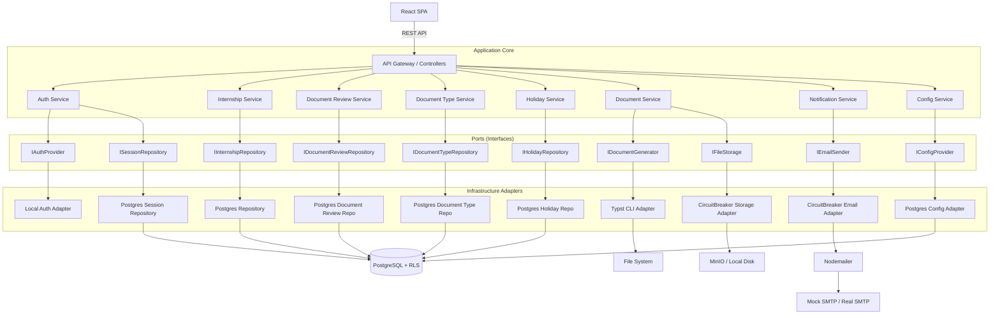

# SOFTWARE ARCHITECTURE DOCUMENT (SAD)

**Project Name:** Internship Management & Automation System (IMAS)

**Security Level:** High Security / KVKK Compliant

---

# 1. INTRODUCTION

## 1.1 Purpose

This Software Architecture Document (SAD) provides a comprehensive architectural overview of the IMAS project. It details the design decisions, technology selection, and structural patterns used to satisfy the requirements defined in the SRS.

## 1.2 Architectural Goals

- **Isolation:** The Core Domain must be independent of the Database and Web Framework (Hexagonal Architecture).
- **Security:** Multi-tenancy must be enforced at the persistence layer (PostgreSQL RLS).
- **Verifiability:** Generated documents must be algorithmically reproducible and verifiable.
- **Adaptability:** Core technologies (PDF engine, authentication provider, storage backend) can be swapped without rewriting business logic.
- **Trusted Tenancy:** Tenant context must be derived from a trusted source, not directly from user‑supplied input.
- **Zero Trust:** Compromised application code must not be able to bypass tenant isolation. Database-level security is authoritative.

---

# 2. ARCHITECTURAL PRINCIPLES

- **SOLID** – Single Responsibility, Open/Closed, Liskov Substitution, Interface Segregation, Dependency Inversion.
- **Separation of Concerns** – Business rules, application orchestration, and infrastructure are cleanly separated.
- **Dependency Injection** – All dependencies are provided via NestJS’s DI container.
- **Fail Fast** – Validation and business rule checks occur early.
- **Design for Change** – Technology-specific implementations are hidden behind abstract ports.
- **Trusted Context** – Tenant and role context derive from server‑side session, not from client‑supplied values.

---

# 3. ARCHITECTURE OVERVIEW

## 3.1 Architectural Pattern: Hexagonal (Ports & Adapters)

The system follows a Modular Monolith structure using Hexagonal Architecture. Business logic remains pure and testable, while external concerns are interchangeable adapters.

### 3.1.1 Layers

- **Domain Layer (Core):** Entities, Value Objects, Business Rules. Zero dependencies.
- **Application Layer (Use Cases):** Orchestrates flow. Defines Ports.
- **Infrastructure Layer (Adapters):** Implements Ports (TypeORM, Typst, Nodemailer, etc.).

### 3.1.2 Module Dependency Rules

- Modules communicate only through Application Services.
- Domain layers must not import from Infrastructure layers.
- Shared utilities must not contain business logic.
- Cross-module communication occurs through defined Ports.

## 3.2 High-Level Component Diagram



---

# 4. TECHNOLOGY STACK

| Component           | Technology         | Justification                                                                                                                            |
| ------------------- | ------------------ | ---------------------------------------------------------------------------------------------------------------------------------------- |
| Runtime             | Node.js v20 LTS    | Asynchronous I/O for high concurrency.                                                                                                   |
| Framework           | NestJS v10+        | Enforces modular architecture, Dependency Injection, and built-in security (guards, pipes).                                              |
| Language            | TypeScript v5+     | Strict typing for domain safety.                                                                                                         |
| Database            | PostgreSQL v16     | Required for native Row-Level Security (RLS). TypeORM used for integration while allowing raw SQL for RLS.                               |
| ORM                 | TypeORM v0.3       | Mature, supports transactions, migrations, and raw SQL access.                                                                           |
| PDF Engine          | Typst v0.11+       | Code-based typesetting for pixel-perfect, high-performance PDF generation (wrapped behind `IDocumentGenerator` port).                    |
| Storage (Local Dev) | MinIO / Local Disk | MinIO emulates S3 locally; easily swapped to cloud S3 in production.                                                                     |
| Caching & Queues    | Redis (optional)   | Session store, rate limiting, and background job queues. Fallback: PostgreSQL-backed queues and in‑memory cache if Redis is unavailable. |
| Containerisation    | Docker             | Consistent environment from development to production.                                                                                   |
| Frontend            | React (SPA) v18+   | Modern, decoupled UI; communicates via REST/JSON.                                                                                        |

---

# 5. ARCHITECTURE DECISION RECORDS (ADR)

| ID      | Decision                        | Rationale                                                                                                   |
| ------- | ------------------------------- | ----------------------------------------------------------------------------------------------------------- |
| ADR-001 | Hexagonal Architecture          | Business logic remains independent of infrastructure; enables testing and future replacements.              |
| ADR-002 | PostgreSQL + RLS                | Database-level tenant isolation is more secure than application-level filtering.                            |
| ADR-003 | Typst for PDF                   | Deterministic, high-performance typesetting; exact layout matching official “Staj Defteri”.                 |
| ADR-004 | NestJS                          | Provides structured module system, guards, interceptors, and pipes that align with security requirements.   |
| ADR-005 | Modular Monolith                | Simpler operation than microservices; modules are clearly separated and could be extracted later if needed. |
| ADR-006 | Ports & Adapters for Auth       | Enables seamless switch from Local Auth to LDAP/SSO without touching business logic.                        |
| ADR-007 | Server-side sessions            | Enables inactivity timeout, logout, and revocation; more suitable than pure stateless JWT for this use case.|
| ADR-008 | SECURITY DEFINER for public/anon| Public verification and employer token validation use controlled DB functions to avoid tenant context issues.|
| ADR-009 | Global audit chain              | Single cryptographic chain across all audit logs strengthens tamper evidence and simplifies verification.   |
| ADR-010 | Dedicated DB roles for admin    | Avoids application‑set `app.current_role='ADMIN'`; admin access via `app_admin` role or SECURITY DEFINER.   |
| ADR-011 | Circuit Breaker for external    | External adapters (Email, Storage) wrapped in Circuit Breaker to satisfy NFR-REL-01.                         |
| ADR-012 | Config Port & Adapter           | Runtime configuration accessed through `IConfigProvider` port implemented by `PostgresConfigAdapter`.       |

---

# 6. PROJECT STRUCTURE

```text
src/
├── main.ts
├── app.module.ts
├── common/
├── modules/
│   ├── auth/
│   ├── user/
│   ├── session/
│   ├── student/
│   ├── internship/
│   ├── company/
│   ├── calendar/
│   ├── holiday/
│   ├── document-type/
│   ├── document-review/
│   ├── sgk/
│   ├── evaluation/
│   ├── document/
│   ├── verification/
│   ├── notification/
│   ├── audit/
│   ├── config/
│   └── admin/
└── shared/
    ├── database/
    ├── storage/
    ├── typst/
    └── config/
```

Each module follows the internal structure:

```
module/
├── domain/
├── application/
├── infrastructure/
└── interface/
```

The `shared/config` directory contains the `IConfigProvider` port definition and utility helpers. The `modules/config` directory contains the NestJS module that provides `PostgresConfigAdapter` and exposes `ConfigService` to other modules.

---

# 7. CROSS-CUTTING CONCERNS

- **Validation:** `class-validator` pipes; business rule violations throw domain exceptions.
- **Error Handling:** Global NestJS exception filter returns standardised JSON (`code`, `message`, `correlationId`).
- **Logging:** Application logs to stdout/stderr; audit logs separate immutable table.
- **Auditing:** Critical changes intercepted and written to immutable audit log.
- **Configuration:** Environment variables for infrastructure; `system_configs` table for business runtime settings, accessed via `IConfigProvider`.
- **Authorization:** Role guards; tenant scoping applied at DB layer via RLS. No `app.current_role='ADMIN'` bypass.
- **Content Negotiation:** Public verification endpoint returns HTML or JSON based on `Accept` header.
- **Circuit Breaker:** External email and storage operations are wrapped in circuit breakers to handle temporary outages.

---

# 8. REQUEST LIFECYCLE

```
HTTP Request
    ↓
Middleware (CORS, Helmet, Rate Limiting, Session)
    ↓
Guard (Authentication & Role Check)
    ↓
Controller
    ↓
Pipe (DTO Validation & Transformation)
    ↓
Application Service (Use Case)
    ↓
Domain Entities / Business Rules
    ↓
Port (Interface)
    ↓
Adapter (with Circuit Breaker if external)
    ↓
Database / External System
    ↓
Response DTO
    ↓
HTTP Response
```

---

# 9. CORE SUBSYSTEM DESIGN

## 9.1 Multi-Tenancy (RLS Implementation)

**Trusted Tenant Context** is established as follows:

- On authentication, the application fetches the user’s `department_id` from the server-side session store (not from client input).
- A dedicated database connection or transaction-scoped context is used to call:
  ```sql
  SET LOCAL app.current_tenant = 'department_uuid';
  ```
  The application never sets `app.current_role` for RLS bypass.
- System-wide admin operations are performed through a dedicated PostgreSQL role (`app_admin`) or SECURITY DEFINER functions. The `app_admin` role has broad privileges and is only assigned to admin sessions through a separate connection pool or context.
- RLS policies do **not** include `current_setting('app.current_role') = 'ADMIN'`.

## 9.2 Authentication & Session Management

Three distinct token types are used:

1. **Session ID**
   - Stored in `sessions` table.
   - Sent to browser clients as `httpOnly`, `Secure`, `SameSite=Strict` cookie.
   - Contains no user data; references server-side session.

2. **Access Token (JWT)**
   - Short-lived (e.g., 15 minutes).
   - Contains `session_id`, `user_id`, `department_id`, `role`.
   - Sent to non-browser clients via `Authorization: Bearer <token>`.
   - Validated against `sessions` table before use.

3. **Refresh Token**
   - Stored in `refresh_tokens` table as a hash.
   - Long-lived (e.g., 7 days absolute lifetime).
   - Rotated on each use; reuse detection invalidates the entire token chain for the user.

### Flow

- Browser login returns session cookie + CSRF token.
- API login returns access token + refresh token.
- `/auth/refresh` accepts refresh token, validates, rotates, returns new access + refresh tokens.
- If a revoked/used refresh token is presented, all refresh tokens for that user are revoked.

## 9.3 Public Verification & Employer Token Access

- **Public verification endpoint** is outside `/api/v1` at `GET /verify/{token}`.
- It calls `verify_document(token UUID)` SECURITY DEFINER function.
- It supports content negotiation:
  - `Accept: text/html` → HTML page.
  - `Accept: application/json` → JSON response.
- **Employer token validation** uses `validate_employer_token(token_hash CHAR(64))` SECURITY DEFINER function.
- The client sends the plain token; the server hashes it (SHA‑256) before calling the function.
- These functions have minimal privileges and are not affected by RLS.

## 9.4 PDF Generation (Typst Integration)

- `DocumentService` collects all data and calls `IDocumentGenerator.generate(data)`.
- Preview PDF is generated synchronously; no verification token/hash is required.
- Final PDF includes QR code, verification UUID, and SHA‑256 hash.
- If generation exceeds 2 seconds, the service switches to async mode:
  - Returns `202 Accepted` with a `jobId`.
  - A background worker completes the generation.
  - User is notified on completion.
- The final PDF is stored in MinIO/local disk and metadata in `documents`.

## 9.5 State Machine with Guards

States: `DRAFT`, `APPLIED`, `REVISION`, `APPROVED`, `REJECTED`, `ONGOING`, `EVALUATION`, `GRADED`, `COMPLETED`, `WITHDRAWN`.

Guard conditions:
- `APPLIED → APPROVED`: all required documents `ACCEPTED`.
- `APPROVED → ONGOING`: SGK `ACTIVE` and current date ≥ start_date; executed by scheduled job with retry.
- `GRADED → COMPLETED`: final PDF generated and archived.

The automatic transition job runs periodically and:
- Finds internships in `APPROVED` with SGK ACTIVE and start_date <= today.
- Transitions them to `ONGOING`.
- Retries up to 3 times with exponential backoff.
- Raises admin alert on final failure.

## 9.6 Application Document Review & Versioning

- `application_documents` supports versioning via new rows with `version_number`.
- Each upload creates a new version; the latest version is current.
- Rejection reason stored with the version.

## 9.7 Workflow History

- `internship_status_history` records every state change with `from_status`, `to_status`, `reason`, `changed_by`, `changed_at`.
- Provides `approved_at` by querying the history.

## 9.8 Notification Persistence & Outbox

- `notifications` table stores in-app notifications.
- `outbox_events` table tracks email delivery with `sent_at`, `error`, `attempts`.
- Outbox pattern: business transaction writes `outbox_event`; worker dispatches emails asynchronously.
- **Email sending adapter is wrapped in a Circuit Breaker** (NFR-REL-01). If the circuit opens, events remain in outbox for retry.

## 9.9 System Configuration Separation

- Infrastructure secrets (DB URL, SMTP credentials) remain environment variables.
- Business runtime configuration (password policy, session timeout, upload limits, token lifetime) stored in `system_configs`.
- Department-specific settings stored in `department_configs`.
- **Runtime configuration is accessed via the `IConfigProvider` port, implemented by `PostgresConfigAdapter` reading `system_configs` and `department_configs`.** The `ConfigService` in `modules/config` uses this port and injects configuration into other modules via DI.

## 9.10 WORM Storage

- Audit logs are written to PostgreSQL with global cryptographic chain.
- In production, audit logs are also exported to immutable S3-compatible storage with Object Lock (WORM).

## 9.11 Company Find‑or‑Create

- `POST /api/v1/companies/find-or-create` allows students to submit a company.
- If `tax_number` exists, returns existing company.
- If not, creates unverified company.

## 9.12 Merged Holidays

- `GET /api/v1/holidays/merged` returns combined global and department-specific holidays for a given department.

## 9.13 Next Term Validation

- **Implemented in `CalendarService` (Calendar Module) via `ICalendarRepository`.**
- **Called by `InternshipService` during application validation (REQ-APP-02).**
- `GET /api/v1/calendars/next-term` returns the next academic term for a department to support this validation.

## 9.14 File Size Precedence

- Effective upload limit = min(global system upload limit, document_type.max_file_size).
- The global limit is configured in `system_configs`.

## 9.15 Circuit Breaker Implementation

- External adapters (Email, Storage) are wrapped in a Circuit Breaker implementation (e.g., `opossum`) to satisfy NFR-REL-01.
- The Circuit Breaker monitors failures and opens when threshold is exceeded; it allows half-open retries after a cooldown.

---

# 10. BACKGROUND JOBS & ASYNC PROCESSING

- **Email sending** via outbox/queue, with Circuit Breaker wrapped adapter.
- **PDF generation** if heavy offloaded to background job.
- **Cleanup** of expired tokens via scheduled job.
- **Auto ONGOING transition** via scheduled job with retry.
- **Notification retry** with exponential backoff.

---

# 11. FILE STORAGE FLOW

- Client upload → validation (type, size, malware scan if available) → `IFileStorage` adapter → Circuit Breaker wrapper → MinIO/local disk → unique filename → metadata saved in PostgreSQL.
- Application documents are versioned; no overwrite.

---

# 12. TRANSACTION STRATEGY

- All mutating operations touching multiple tables are wrapped in DB transactions.
- Outbox events are written in the same transaction.
- Optimistic locking via `updated_at` comparison prevents lost updates.

---

# 13. DATABASE MIGRATIONS

- Managed by TypeORM migrations.
- Schema changes only through migrations.

---

# 14. DEPLOYMENT ARCHITECTURE (Local Development)

```mermaid
graph TD
    Browser[Browser] --> React[React Dev Server]
    React --> API[NestJS API]
    API --> DB[PostgreSQL]
    API --> MinIO[MinIO / Local Disk]
    API --> SMTP[Mailpit (Mock SMTP)]
    API --> Redis[Redis (optional)]
```

Production: React static files behind Nginx; API and DB separated; S3-compatible object store with Object Lock for WORM.

---

# 15. CONFIGURATION MANAGEMENT

- **Environment variables:** infrastructure secrets.
- **`IConfigProvider` port & `PostgresConfigAdapter`:** runtime business settings from `system_configs` and `department_configs`.
- **`department_configs` table:** department-specific settings.

---

# 16. LOGGING & MONITORING

- Application logs structured JSON to stdout.
- Audit logs immutable, cryptographically chained globally.
- Health check endpoint.
- Admin alerts on job failures.
- Circuit breaker state changes logged.

---

# 17. FUTURE EXTENSION POINTS

- **Authentication:** Swap Local Auth adapter with LDAP/SSO.
- **Storage:** Replace MinIO with AWS S3 / Azure Blob.
- **PDF Engine:** Replace Typst with Puppeteer.
- **Scaling:** Extract modules into microservices if needed.
- **Multi‑language:** i18n resource files.

---

# 18. CONCLUSION

The architecture satisfies the SRS with a clean separation of concerns, trusted multi-tenancy, robust security, and adaptability. This version fully resolves all cross-document inconsistencies and provides a solid foundation for implementation.